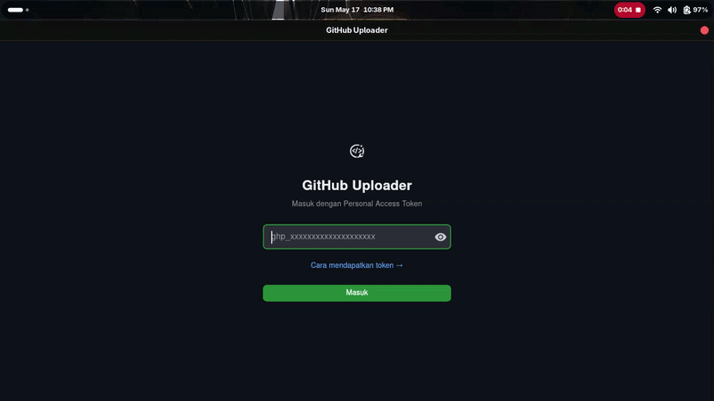

# GitForge

<div align="center">
  
</div>

A cross-platform desktop GUI for managing GitHub repositories — create, upload, clone, branch, and manage tags, releases, and topics.

<div align="center">
  
  
  
  
</div>

---

## Features

| Feature | Description |
|---------|-------------|
| **Authentication** | Secure login via GitHub Personal Access Token (PAT), persistent session with keyring |
| **Dashboard** | View all repositories with search, visibility filter (public/private), and sort options |
| **Create Repository** | Create repos with customizable `.gitignore` (searchable template picker) and custom license file upload |
| **Upload** | Upload folders or files to any repository with progress tracking |
| **Clone** | Clone repositories locally with branch selection |
| **Branch Management** | View, create, and delete branches |
| **Repository Settings** | Update visibility, description, features, and merge settings |
| **Info & Management** | View repo details, manage tags, releases, and topics |

## Screenshots

| Page | Description |
|------|-------------|
| **Login** | Token input form with real-time validation |
| **Dashboard** | Repository grid with search, filter, and sort |
| **Upload** | Folder/file selection with progress dialog |

## System Requirements

- **Operating System:** Linux (x86_64) — compatible with Arch Linux, Ubuntu, Debian, Fedora, openSUSE, and other major distributions
- **Python:** 3.11 or newer
- **Git:** Installed and available in `PATH`
- **GitHub PAT:** Personal Access Token with `repo` and `delete_repo` scopes

## Installation

### Setup & Run

```bash
git clone https://github.com/Riflxz/GitForge
cd GitForge
bash run.sh setup    # Install dependencies (cukup sekali)
bash run.sh start    # Jalankan aplikasi
```

### Distribution-Specific Prerequisites

**Arch Linux:**
```bash
sudo pacman -S python python-pip git tk
```

**Ubuntu / Debian:**
```bash
sudo apt install python3 python3-pip python3-venv git python3-tk
```

**Fedora:**
```bash
sudo dnf install python3 python3-pip git python3-tkinter
```

**openSUSE:**
```bash
sudo zypper install python3 python3-pip git python3-tk
```

## Running the Application

```bash
bash run.sh          # Start (auto-setup jika venv belum ada)
bash run.sh setup    # Setup ulang dependencies
bash run.sh check    # Cek dependencies sistem
bash run.sh help     # Bantuan
```

## Obtaining a GitHub Token

1. Go to [GitHub Token Settings](https://github.com/settings/tokens/new)
2. Select the following scopes:
   - **repo** — Full control of private repositories
   - **delete_repo** — Repository deletion
3. Click **Generate token**
4. Copy the token and paste it into the application login screen

> **Security:** Your token is stored securely using your system's keyring (via the `keyring` library). It is never exposed in plain text or shared.

## Project Structure

```
GitForge/
├── main.py                  # Entry point & routing
├── config.py                # Global constants & theme colors
├── requirements.txt         # Python dependencies
├── run.sh                   # Script utama (setup/start/check/help)
├── logo.png                 # Logo aplikasi
├── icon.png                 # Icon window
├── gif.gif                  # Demo GIF
├── fixed.md                 # Changelog
├── core/
│   ├── auth.py              # Token management (keyring)
│   ├── file_dialog.py       # File picker (tkinter fallback)
│   ├── git_ops.py           # Git operations (clone, push)
│   ├── github_api.py        # PyGithub wrapper
│   └── state.py             # Global application state
├── pages/
│   ├── login_page.py        # Login screen
│   ├── dashboard_page.py    # Repository dashboard
│   ├── create_repo_page.py  # Repository creation
│   ├── upload_page.py       # File upload
│   ├── clone_page.py       # Repository cloning
│   ├── branch_page.py      # Branch management
│   ├── edit_repo_page.py   # Repository settings
│   └── info_page.py        # Repository info & release/tag management
└── components/
    ├── dialogs.py           # UI dialogs (error, success, confirm, progress)
    ├── file_item.py         # File item component
    ├── repo_card.py         # Repository card component
    └── sidebar.py           # Navigation sidebar
```

## Demo

<div align="center">
  
</div>

## Technology Stack

| Technology | Version |
|------------|---------|
| [Python](https://www.python.org/) | 3.11+ |
| [Flet](https://flet.dev/) | 0.24 |
| [PyGithub](https://pygithub.readthedocs.io/) | 2.1 |
| [GitPython](https://gitpython.readthedocs.io/) | 3.1 |
| [keyring](https://github.com/jaraco/keyring) | 24.3 |

## License

This project is open source and distributed under the **MIT License**. See the [LICENSE](LICENSE) file for details.
